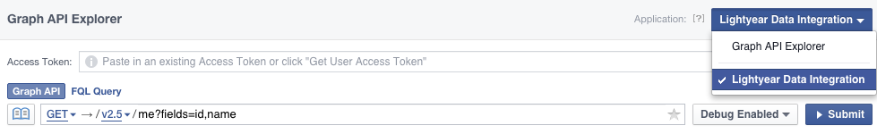
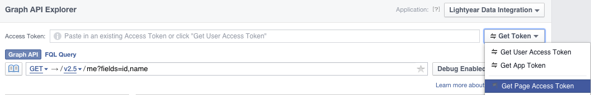

% Lightyear Server Build
% Minesh Patel
% 22 Mar 2016

Build notes for Lightyear EC2 server built on AWS. Can use this guide to replicate the system if the image gets destroyed.

# Summary

* **Instance Name:** Lightyear Foundation
* **IP Address:** 10.0.2.135
* **Storage:** 8GB
* **Instance ID:** `i-e79e2a6d`
* **Instance Type:** `t2.micro`
* **VPC Subnet:** rmc-dev Private (eu-west-1b)
* **Security Group:** LYF SG
* **Key:** Lightyear
* **OS:** Amazon Linux (2015.9) : `4.1.17-22.30.amzn1.x86_64`
* **OS User:** `lightyear`

Main application is in `/u01/lightyear` and is a clone of the following [Git repository](https://github.com/mineshpatel1/lightyear). This directory will be referred to from now as `$APP_HOME`. The primary configuration file is `config.ini` which should be copied from `config.ini.sample` and filled in with the relevant details for your installation.

# Security

Currently, connection can only be established from within the [Rittman Mead VPN](https://openvpn.ritt.md/?src=connect) using the key listed [above](#summary). 

The following users have been created and granted `sudo` privileges by assigning the `wheel` group.

* `ec2-user`
* `lightyear`

Passwords will **not** be listed directly in this document.

## User Setup

```bash
sudo useradd lightyear
sudo usermod -a -G wheel lightyear
sudo cp -r /home/ec2-user/.ssh /home/lightyear/
sudo chown lightyear:lightyear /home/lightyear/.ssh -R
sudo visudo	# Uncomment line 101, allows sudo to those in wheel
```

# Software

## Python Libraries

```bash
sudo pip install --upgrade pip
pip=/usr/local/bin/pip2.7

sudo $pip install httplib2
sudo $pip install tweepy
sudo $pip install apiclient
sudo $pip install --upgrade google-api-python-client
sudo $pip install psycopg2
```

## Yum Packages

```bash
sudo yum install git
sudo yum install gcc
sudo yum install postgresql-devel
```

## Clone Git Repository

```bash
sudo mkdir /u01
cd /u01
sudo git clone -b develop https://github.com/mineshpatel1/lightyear.git
sudo chown -R lightyear:lightyear lightyear/
```

# Database

## PostgreSQL

Install the [PostgreSQL server](http://www.postgresql.org/download/linux/redhat/) and initialise the database to automatically start with the instance.

```bash
sudo service postgresql initdb
sudo chkconfig postgresql on
sudo service postgresql start
```

This creates a root user `postgres` that can be used for initial setup. Change the password to allow access to this user.

```bash
sudo passwd postgres
su postgres
psql # Start PostgreSQL using the default database
```

Run the following commands to create a new database, user and schema.

```sql
CREATE USER lightyear PASSWORD 'xxx';
CREATE DATABASE lightyear OWNER lightyear ENCODING 'UTF8';
CREATE SCHEMA lyf;
GRANT ALL ON SCHEMA lyf to lightyear;
GRANT ALL ON ALL TABLES IN SCHEMA lyf TO lightyear;
\q
```

### Allow External Communication

Change the listen address to all instead of localhost and allow connections from the Rittman Mead subnet.

```bash
sudo vi /var/lib/pgsql9/data/postgresql.conf
listen_addresses = '*'	# Line 59

sudo vi /var/lib/pgsql9/data/pg_hba.conf
host all all 10.0.0.0/16 md5	# Add to end of file

sudo service postgresql restart
```

Lastly, allow 5432 as an inbound port on the security group in AWS. This has already been done for security group **LYF SG**.

# API Authentication

## Facebook

The main app uses the [Facebook Graph API](https://developers.facebook.com/docs/graph-api) to retrieve page information and insights data. There is a one-off set up to create a permenant [page access token](https://developers.facebook.com/docs/facebook-login/access-tokens#pagetokens) with `manage_pages` and `read_insights` [permissions](https://developers.facebook.com/docs/facebook-login/permissions). There are a number of valid ways of doing this, the following steps describe only one way of achieving the outcome.

> These steps must be performed by an administrator of the chosen Facebook page.

1. Create a Facebook app from the [developer console](https://developers.facebook.com/). This will allow us to dissociate the specific admin user from the authentication. In this example our app is called **Lightyear Data Integration**.

2. From the app's main dashboard, make a note of the *App ID* and the *App Secret* (requires admin password). Fill in the respective parameters (`app_id`, `app_secret`) in the `FACEBOOK` section of `config.ini`.

3. Navigate to the [Facebook Graph API Explorer](https://developers.facebook.com/tools/explorer) and select your created app from the drop down menu on the right hand side.



3. Use the *Get Token* button to generate a **Page Access Token**. This will allow us to default to the Facebook page profile rather than that of the user.



4. You will be prompted to authorise the application for basic privileges. *Before* accepting, copy the URL and add `,read_insights` to the scope argument (end of the URL) and then refresh the page.
5. Back in the explorer, set the dropdown to be the page you wish to manage. In this example it is **Lightyear Foundation**.
6. Copy this access token into the `FACEBOOK/access_token` parameter in `config.ini`
7. This step will automatically retrieve a permanent version of the token from Facebook and write it to `config.ini`. On the server navigate to `$APP_HOME` and execute the following in `python`:

```python
import lyf
lyf.renew_fb_token()
exit()
```

8. Finally, you can use the [debugger](https://developers.facebook.com/tools/debug/accesstoken?q=) check if the token in `config.ini` has been updated correctly. The expiry date should be set to *Never*.

